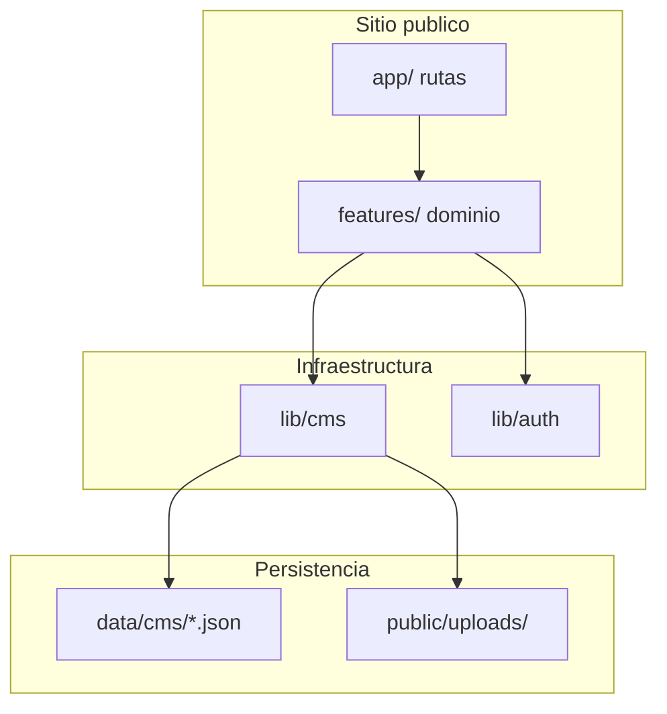
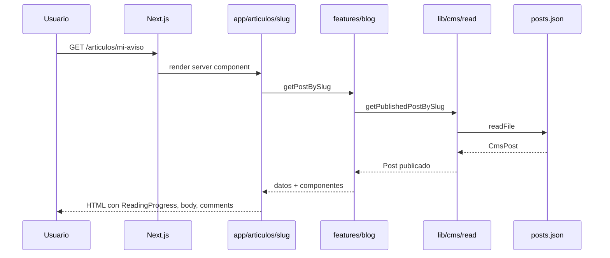
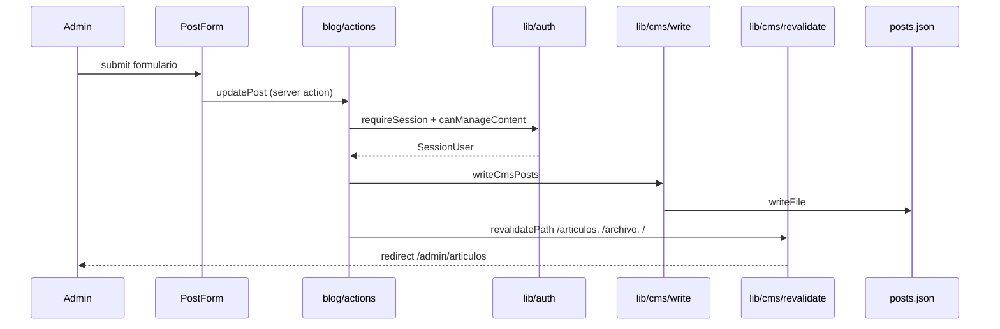
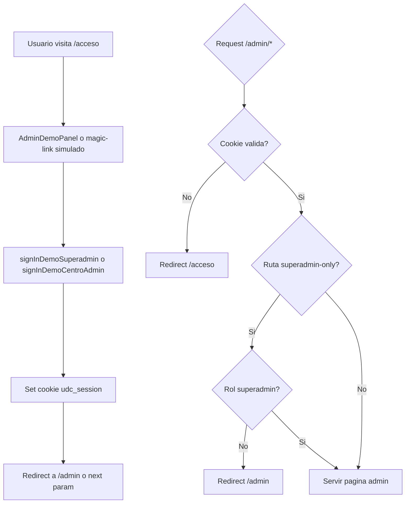
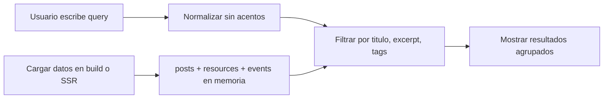
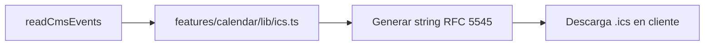
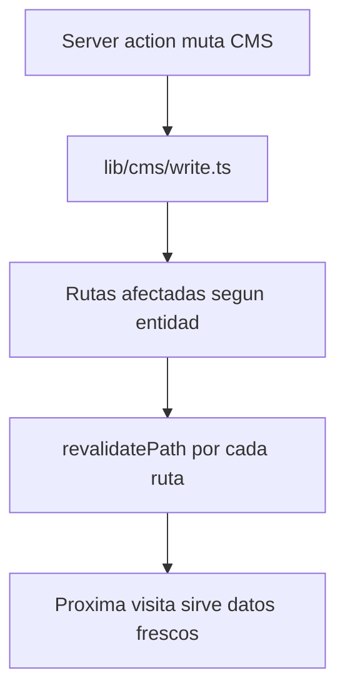

# Diagramas de funcionamiento

Diagramas Mermaid que describen los flujos principales del MVP.

---

## Capas de la aplicación

---

## Lectura pública

Flujo cuando un usuario visita una página del sitio (p. ej. `/articulos/mi-aviso`).

---

## Mutación admin

Flujo cuando un editor guarda un artículo desde el panel.

---

## Autenticación demo

---

## Búsqueda del sitio

La búsqueda en `/buscar` es **client-side**: no hay endpoint de API.

Implementación: [`src/features/blog/lib/search.ts`](../../src/features/blog/lib/search.ts).

---

## Exportación de calendario

---

## Revalidación tras mutación

Entidades y rutas típicas:

| Entidad | Rutas revalidadas |
|---------|-------------------|
| Post | `/`, `/archivo`, `/articulos/[slug]`, `/buscar` |
| Evento | `/calendario` |
| Recurso | `/recursos` |
| Bienestar | `/bienestar` |
